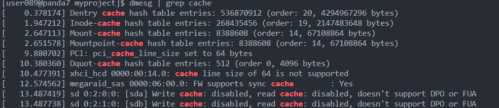

### 最终设计

数据结构：allSitesState保存所有座位信息，将信息展平，方便利用Cache

```java
private ArrayList<SiteState> allSitesState;
```

座位状态表示：利用bitmap表示座位状态，并且利用Cache进行加速

```java
public interface SiteStateBase {
    int SiteRouteId = 0;      // 车次
    int SiteCoachId = 0;      // 车厢号
    int SiteSeatId = 0;       // 座位号
    int siteStateBits = 0;    // bitmap表示
    int GetCoach();
    int GetSeat();
    void AddPassenger(Ticket ticket);
    void RemovePassenger(Ticket ticket);
    public boolean haveSite(int departure, int arrival);
    public void printSite();
    static final int allSateArray []= {xxxxx}
}
```

nextTid：利用AtomicLong生成，对于争用激烈的情况，将AtomicLong替换为BackOffAtomicLong，可以有效减轻争用，用AtomicLong跑不完64线程10w操作的测试，但换成BackOffAtomicLong可以完成测试。

```java
// private BackOffAtomicLong nextTid;
private final AtomicLong nextTid;
```


### 核心代码

买票时首先从分散的信息转换为座位的线性地址，只会利用synchronized对newSite进行同步

```java
for (int i = getRouteFirstIndex(route - 1); i <= getRouteLastIndex(route - 1); i++) {
    SiteState newSite = allSitesState.get(i);
    // synchronized one SiteState
    synchronized (newSite){
        if (newSite.haveSite(departure, arrival)) {
            ticket.coach = newSite.GetCoach();
            ticket.seat = newSite.GetSeat();
            newSite.AddPassenger(ticket);
            find = true;
            break;
        }
    } // synchronized
}
```

查票从分散的信息转换为座位的线性地址后查询状态

```java
for (int i = getRouteFirstIndex(route - 1); i <= getRouteLastIndex(route - 1); i++){
    if (allSitesState.get(i).haveSite(departure, arrival)) {
        num++;
    }
}
```

退票从分散的信息转换为座位的线性地址后，更新bitmap

```java
SiteState siteState = allSitesState.get(i);
synchronized(siteState) {
    siteState.RemovePassenger(ticket);
}
```

### bitmap

以买票为例，可以将base放到循环外部，这样单次只需要使用`base <<= 1`一次操作，而不需要`base <<= i`，做强度减弱，同时由于map信息固定，利用数组将site固定，充分利用cache存放allSateArray

allSateArray只有434项 ，空间消耗 < 512 * 4B  = 2KB < 4KB

在一页之内，同时可以放到Cache中（下图为服务器Cache信息）:



```java
public void AddPassenger(Ticket ticket) {
    // 利用循环设置:
    // int departure = ticket.departure;
    // int arrival = ticket.arrival;
    // departure--;
    // arrival--;
    // int base = 2 << departure;
    // for (int i = departure; i < arrival; i++) {
    //     siteStateBits |= base;
    //     base <<= 1; // 强度削减
    // }
    
    // 利用Cache:
    final int bits = allSateArray[getIndex(ticket)];
    siteStateBits |= bits;
}
```

清除状态信息：

```java
public void RemovePassenger(Ticket ticket) {
    int bits = allSateArray[getIndex(ticket)];
    bits = ~bits;
    siteStateBits &= bits;
}
```

查询:

```java
public boolean haveSite(int departure, int arrival) {
    final int bits = allSateArray[getIndex(departure, arrival)];
    return (bits & siteStateBits) == 0;
}
```

将车票映射为线性状态地址

```java
int getIndex(int departure, int arrival) {
    departure--;
    arrival--;
    return (departure*(57 - departure) / 2) + arrival - 1;
}
```


### 可线性化分析

系统利用synchronized进行同步，满足可线性化要求

### 性能评测

正确性测试：


吞吐量测试(受服务器负载影响较大)：

每个线程操作1w次：


每个线程操作10w次：


### 设计思路

#### 第一版设计的思考：锁是关键

最初设计：

存放一个基于route的FreeList，最初的设想是：

当座位上整个时间段（从第一站到最后一站）只有一个人坐的时候，买卖票只会在route上进行，此时不需要其它数据结构参与，就可以实现整个系统。

如果FreeList有空位，那就直接从其中选出座位，在退票时，检查座位状态维护FreeList

测试结果很差，原因如下:

1. 减少的操作数并没对时间产生显著的增益，可见常数的操作对系统吞吐量影响不大
2. 当线程数增加时，性能明显下降，从80op/ms => 16 op/ms，原因是：线程数 > 锁的数量，导致线程之间锁竞争激烈，**大部分的时间后消耗在锁的争用**上

解决方案：

细化锁的力度，每个座位维护一个锁，这样在64线程的情况下，依然满足：线程数 < 锁的数量，**吞吐量在线程变化时保持稳定**

#### 优化单次操作

利用区间表示座位状态比较低效，采用BitMap进行优化，此时只需要维护一个sate整数，用于表示座位的状态，用锁保证操作的正确性。

#### Cache是关键

进一步将bitMap优化，将所有状态打印到一个数组中，将操作优化到常数级别，但和之前一样，常数级的操作不会对性能产生显著影响，但是由于采用常量数组，元素会存放在L1和L2 Cache中，访问Cache能对系统性能显著提升

在个人PC上测试，在用细粒度锁时吞吐量从150op/ms提升到 200op/ms，提升30%

#### 第二版设计的思考：细化各种锁的选择

如下三种方式性能依次提升：

1. java当前版本的锁默认是可重入的，采用此方法可以有效避免死锁，但是对于此问题，也可以通过**先释放，再判断条件是否满足，之后再次申请锁**，如果成功就终止，否则重试，的方式来解决，在高并发时性能比较差。

2. 读写锁，将读写分开，inquery时申请读锁，同时对于buy方法，在查询座位状态时可以申请读锁，在更改座位状态时，将读锁释放，申请写锁
3. stamp读写锁，乐观锁，优化锁的设计，但需要保存提供时间戳。

#### 第三版设计的思考：将锁换成同步

java版本：

```java
openjdk version "1.8.0_345"
OpenJDK Runtime Environment (build 1.8.0_345-b01)
OpenJDK 64-Bit Server VM (build 25.345-b01, mixed mode)
```

OpenJDK中Synchronization：

在低于1.6中，synchronized是利用信号量等同步机制进行的，但在>1.6的版本中，synchronized做了CAS的优化，具体如下：

在Hotspot中，每个对象前面都有一个类指针和一个标头字，标头字存储身份哈希代码以及用于代际垃圾收集的年龄和标记位，也用于实现**thin lock scheme**。


图的右侧说明了标准锁定过程。只要对象被解锁，最后两位的值为 01。当方法在对象上同步时，标头字和指向对象的指针存储在当前堆栈帧内的锁定记录中。然后，VM 尝试通过**CAS**操作在对象的标头字中安装指向锁定记录的指针。如果成功，则当前线程随后拥有锁。由于锁定记录始终在字边界对齐，因此标头字的最后两位为 00，并将对象标识为已锁定。

如果比较和交换操作因对象之前被锁定而失败，则 VM 首先测试标头字是否指向当前线程的方法堆栈。在这种情况下，线程已经拥有对象的锁，并且可以安全地继续执行。对于此类递*归*锁定的对象，锁定记录使用 0 而不是对象的标头字进行初始化。仅当两个不同的线程在同一对象上同时同步时，细锁才必须**膨胀**到重量级监视器，以管理等待线程。

### 线性化验证

Hoistory数据结构存储线程信息执行的每个操作信息和结果，用于进一步检测，生成History List

```java
public class History implements Comparable{
    public long preTime;
    public long postTime;
    public String action;
    public int route;
    public int coach;
    public int departure;
    public int arrival;
    public int seat;
    public long tid;
    public int threadID;
    String passenger;
    boolean flag;
    String result;
    Integer currentNum;
}
```

同时对历史按时间进行排序

```java
public int compareTo(Object o) {
    History r = (History) o;
    if(this.preTime == r.preTime) {
        return this.postTime < r.postTime? 1 : 0;
    } else {
        return this.preTime < r.preTime? 1 : 0;
    }
}
```

仿照人工寻找可线性化点的方法，在必须先交的情况下，必须相交否则就设置可线性化为`false`

```java
// 先卖再买，必须相交，相交时可以取相交位置为可线性化点，否则不可线性化
if (h2.action == "buyTicket" && h1.action == "refundTicket" && !crossToHistory.get(h1).contains(h2)) {
    verifyRes = false;
}
```

其中crossToHistory的结果是利用generateCrossHistory函数生成：

```java
public static void generateCrossHistory(ArrayList<History> aHistory) {
    for (int i = 0; i < aHistory.size(); i++) {
        History h1 = aHistory.get(i);
        ArrayList<History> list = new ArrayList<>();
        for (int j = 0; j < aHistory.size(); j++) {
            History h2 = aHistory.get(j);
            if (isCross(h1, h2)) {
                list.add(h2);
            }
        }
        crossToHistory.put(h1, list);
    }
}
```


### 附录A：项目目录结构

SiteStateBase.java和SiteState.java：分别对应bitmap的基类和实现

BackOffAtomicLong.java：带回退的AtomicLong

Verify.java：用于可线性化验证

### 附录B：BackOffAtomicLong

```java
package ticketingsystem;

import java.util.concurrent.atomic.AtomicLong;
import java.util.concurrent.locks.LockSupport;

public class BackOffAtomicLong {
    public static long bk;
    private final AtomicLong value = new AtomicLong(0L);

    public long get() {
        return value.get();
    }

    public long getAndIncrement() {
        for (; ; ) {
            long current = get();
            long next = current + 1;
            if (compareAndSet(current, next))
                return next;
        }
    }

    public boolean compareAndSet(final long current, final long next) {
        if (value.compareAndSet(current, next)) {
            return true;
        } else {
            LockSupport.parkNanos(2L);

            return false;
        }
    }

    public void set(final long l) {
        value.set(l);
    }
}
```